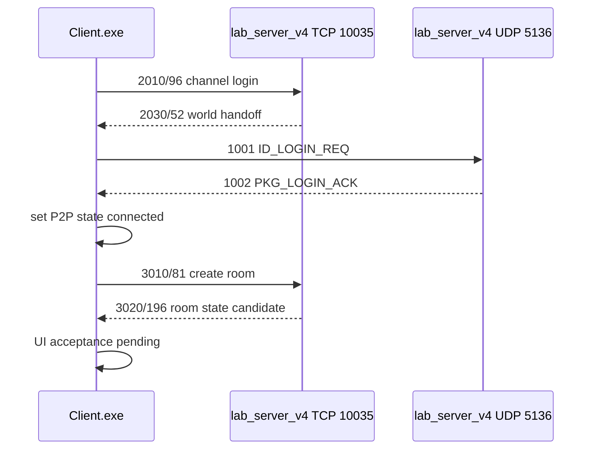

# SDP2P UDP 登录握手逆向与实现报告

- 日期：2026-09-07（Asia/Shanghai）
- 状态：阶段性完成；UDP login/keepalive 已被真实客户端日志推进，`3010 -> 3020/196` 房间状态候选已实现，真实点击验证待补
- flavor：`null`
- 授权与范围：沿用 `research/2026-09-06/work/login-to-world/scope.md`；仅分析用户自有隔离客户端和 `127.0.0.1` 本地服务，正式安装目录保持只读

## 执行摘要

本轮把上一阶段的“5136 P2P 未连接”推进到可运行服务端实现。`SDP2P.dll` 已在 IDA 中作为 32 位 PE 正确载入，导入表包含 `sendto/recvfrom/WSAAsyncSelect`，并确认 P2P 连接层使用 UDP 而不是 TCP 应用协议。逆向恢复了 24 字节 P2P header、`1001 ID_LOGIN_REQ`、`1002 PKG_LOGIN_ACK` 和 `1013/1014` keepalive 的最小字段布局；真实客户端日志已看到 `1001`、`1013` 以及服务端对应响应。随后真实 10035 日志捕获到 `3010/81` 创建房间请求，payload 起始 GBK 字符串为 `t07的房间`。主程序 IDA 确认 `3020` 由 `0x8253A0` 处理，相关 copy/helper 路径消费 196 字节房间状态；当前 mock 已实现 `3010 -> 3020/196` 候选响应并通过本地 socket 烟测。下一步是让真实客户端重新触发建房请求，观察 `3020/196` 后的 UI 和后续消息。

## Evidence

### E-044

- title: `SDP2P.dll` PE 载入与关键函数反编译
- observed_at: 2026-09-07 16:20-16:40 +08:00
- source_type: ida_mcp
- source_ref: IDA MCP `survey_binary` / `analyze_function`
- content_hash: `3F8120FCDA641FA898618B66926655C6F0F5E28C50999E855445F239D60CF160`
- artifact_path: `research/2026-09-06/spc32/work/client-test/SDP2P.dll`
- repro_command: |
    在 IDA 打开 `SDP2P.dll` 为 Portable executable for 80386 后，调用 `survey_binary(detail_level="minimal")`，再分析 `0x10003c60`、`0x10003840`、`0x10004100`、`0x10004260`、`0x100085a0`。
- raw_excerpt: |
    survey: module=`SDP2P.dll`, arch=`32`, base=`0x10000000`, sha256=`3f8120fc...cf160`
    0x10003c60: 逐字段复制 24 字节 header，并以 header[23] 作为 route byte count。
    0x100085a0: `PKG_LOGIN_ACK` decoder 读取 4 个 `u32` 和 1 个 `u16`，标量经 `ntohl/ntohs`。
- linked_workitem: n/a
- supersedes: none

### E-045

- title: UDP P2P login ACK 实现
- observed_at: 2026-09-07 16:41 +08:00
- source_type: file
- source_ref: `research/2026-09-06/work/login-to-world/p2p_protocol.py`, `research/2026-09-06/work/login-to-world/lab_server_v4.py`
- content_hash: n/a
- artifact_path: n/a
- repro_command: |
    查看 `p2p_protocol.py` 的 `parse_datagram` / `build_login_ack`，以及 `lab_server_v4.py` 的 `P2PUDPHandler`。
- raw_excerpt: |
    UDP handler 收到 `ID_LOGIN_REQ(1001)` 后，按请求 header 的 session 构造 `PKG_LOGIN_ACK(1002)`，header `+12=0`，header `+16=1001`，body 回显客户端 UDP 源 IP 与端口。
- linked_workitem: n/a
- supersedes: none

### E-046

- title: P2P 协议单测与角色链路回归
- observed_at: 2026-09-07 16:44 +08:00
- source_type: command
- source_ref: local unittest
- content_hash: n/a
- artifact_path: n/a
- repro_command: |
    cd C:\Users\24032\Desktop\code\kungfu-mock-server\research\2026-09-06\work\login-to-world
    python -B -m unittest discover -s . -p 'test_*protocol.py'
    cd C:\Users\24032\Desktop\code\kungfu-mock-server\research\2026-09-07\role-create
    python -B -m unittest discover -s . -p 'test_role_protocol.py'
- raw_excerpt: |
    login-to-world: Ran 13 tests, OK
    role-create: Ran 9 tests, OK
- linked_workitem: n/a
- supersedes: none

### E-047

- title: `3010/81` 建房请求捕获与 `3020/196` 候选响应
- observed_at: 2026-09-07 17:05-17:50 +08:00
- source_type: dynamic_log + ida_mcp + command
- source_ref: `evidence/lab-wire-v4.jsonl`; IDA MCP `server_health` / `survey_binary` / `decompile`; local smoke test
- content_hash: `707450b209937b2d3e94a68ffe8f9841821ff048fd1cc0d8017d1fdddf493c3b`
- artifact_path: `research/2026-09-06/spc32/work/game-runtime.bin.i64`
- repro_command: |
    在 IDA 中切回 `game-runtime.bin.i64` 后确认 `module=game-runtime.bin`，反编译 `0x825120`、`0x825460`、`0x520CC0`、`0x826090` 和 `3010` 发送入口 `0x890F00`、`0x907450`、`0x911430`、`0x91AA00`、`0x91D3C0`。
    cd C:\Users\24032\Desktop\code\kungfu-mock-server\research\2026-09-06\work\login-to-world
    python -B -m unittest discover -s . -p 'test_*protocol.py'
    python -B .\smoke_3010.py
- raw_excerpt: |
    real log: `3010/81`, payload name prefix decodes as `t07的房间`.
    IDA: message table contains `3020 -> 0x8253A0`; `sub_520CC0` copies a 196-byte room state; `sub_826090` writes mode at `0x54` and room id at `0x61`.
    smoke: `message_id=3020 key_index=0 payload_len=196`, `off_54=01000000`, `off_61=e9030000`.
    watcher after patch: 75 seconds with no new real `3010/3020`, so real-client acceptance remains pending.
- linked_workitem: n/a
- supersedes: none

## Findings

### F-024

- title: 5136 的 SDP2P 应用层为 UDP 握手
- severity: n/a_re
- category: reverse_algo
- status: validated
- evidence_ids: [E-044]
- location: `SDP2P.dll` imports and functions `0x10005570`, `0x10005f50`, `0x10004260`
- impact: 只监听 TCP 5136 无法满足 P2P 模块的连接状态机；需要同端口 UDP listener。
- confidence: high
- repro_steps:
  1. 在 IDA 中确认 `sendto/recvfrom/WSAAsyncSelect` 导入。
  2. 查看 UDP socket 创建函数和接收分派函数。
- remediation: n/a for reverse engineering
- optional_attack: n/a

### F-025

- title: P2P header 为 little-endian 裸字段，body 标量为网络序
- severity: n/a_re
- category: reverse_algo
- status: validated
- evidence_ids: [E-044, E-046]
- location: `SDP2P.dll` `0x10003c60`, `0x10004100`, `0x10004260`, `0x10008220`, `0x10008260`, `0x100081a0`, `0x100085a0`
- impact: 服务端 ACK 必须混用两种字节序：header 不能按网络序整体编码，body 的整数必须按 `htonl/htons` 兼容；同时 header `+12` 必须为 0 才会进入 server 分支，header `+16` 用于预登录阶段写入客户端 P2P ID。
- confidence: high
- repro_steps:
  1. 查看 `0x10003c60` 的逐字段 header 拷贝。
  2. 查看 body encoder/decoder 的 `htonl/ntohl` 与 `htons/ntohs`。
  3. 运行 `test_p2p_protocol.py` 校验构造结果。
- remediation: n/a for reverse engineering
- optional_attack: n/a

### F-026

- title: v4 已具备最小 `1001 -> 1002` P2P 登录响应
- severity: n/a_re
- category: reverse_algo
- status: candidate
- evidence_ids: [E-045, E-046]
- location: `lab_server_v4.py` `P2PUDPHandler`
- impact: 这应解除“还没有连接P2PServer”的前置硬门，但真实客户端尚未重启验证，不能提前宣称房间创建成功。
- confidence: medium
- repro_steps:
  1. 运行 login-to-world 协议测试。
  2. 启动 v4 后让真实客户端进入大厅并再次创建团体战房间。
- remediation: n/a for reverse engineering
- optional_attack: n/a

### F-027

- title: 房间创建已进入 `3010 -> 3020/196` 候选响应阶段
- severity: n/a_re
- category: reverse_algo
- status: candidate
- evidence_ids: [E-047]
- location: `game-runtime.bin.i64` message table `3020 -> 0x8253A0`; `role_protocol.py` `build_room_create_ack_payload`
- impact: “点确定没反应”不能再简单归因于缺 P2P 首包或缺 `3010` 响应；当前 mock 已能返回结构长度匹配的 `3020`，需要真实客户端重新发出 `3010` 后才能判断 UI 是否接受。
- confidence: medium
- repro_steps:
  1. 查看真实日志中的 `3010/81` 建房请求，确认房间名字段。
  2. 运行 `test_*protocol.py` 和 `smoke_3010.py`，确认 `3020/196` 输出。
  3. 在真实客户端重新点击创建房间，观察是否出现新的 `3010` 以及后续 UI/消息。
- remediation: n/a for reverse engineering
- optional_attack: n/a

## Path

### P-005

- title: 大厅到 P2P connected 的最小调用路径
- path_type: callflow
- start: 真实客户端接受 `2030/52` 后连接 `127.0.0.1:5136`
- goal: 客户端 P2P 状态进入 connected，随后发送真实创建房间请求
- steps:
  1. action: `2030` 提供世界 ID、`127.0.0.1:5136` 和 route ID；evidence: E-040；finding: F-022
  2. action: `SDP2P.dll` 通过 UDP socket 向 5136 发送 `ID_LOGIN_REQ(1001)`；evidence: E-044；finding: F-024
  3. action: v4 UDP handler 返回 `PKG_LOGIN_ACK(1002)`，session 与请求 header 保持一致，`+12=0`，`+16=1001`；evidence: E-045/E-046；finding: F-026
  4. action: 真实客户端发出 `3010/81` 建房请求；evidence: E-047；finding: F-027
  5. action: v4 返回 `3020/196` 房间状态候选；evidence: E-047；finding: F-027
  6. action: 真实客户端重新点击后观察 `3020/196` 是否被 UI 接受；evidence: pending；finding: pending
- residual_risks: `3020/196` 当前通过 IDA 结构恢复和本地 socket 烟测，但真实客户端尚未在补丁后重新发出 `3010`；若仍无请求，需要追 `3010` UI 发送入口的本地状态门槛。



## 实现变更

| 文件 | 变更 |
|---|---|
| `research/2026-09-06/work/login-to-world/p2p_protocol.py` | 新增 P2P header 解析、datagram 构造、login request 解码、login ACK 构造 |
| `research/2026-09-06/work/login-to-world/lab_server_v4.py` | 新增 `P2PUDPHandler` / `P2PUDPServer`，main 中额外启动 UDP 5136 |
| `research/2026-09-06/work/login-to-world/test_p2p_protocol.py` | 新增 wire layout、login request、login ACK、UDP socket 往返测试 |
| `research/2026-09-06/work/login-to-world/lab-control.json` | 新增运行中旧进程可热读的 `3010 -> 3020/196` fallback |
| `research/2026-09-06/work/login-to-world/role_protocol.py` | 新增 `build_room_create_ack_payload()` 和 `RoleSession` 的 `3010/81 -> 3020/196` 分支 |
| `research/2026-09-06/work/login-to-world/test_game_protocol.py` | 校验 `3010` 配置与 room-state builder 一致 |

## 复现步骤

```powershell
Set-Location -LiteralPath 'C:\Users\24032\Desktop\code\kungfu-mock-server\research\2026-09-06\work\login-to-world'
python -B -m unittest discover -s . -p 'test_*protocol.py'
python -B .\smoke_3010.py

Set-Location -LiteralPath 'C:\Users\24032\Desktop\code\kungfu-mock-server\research\2026-09-07\role-create'
python -B -m unittest discover -s . -p 'test_role_protocol.py'
```

## 下一阶段

1. 让真实隔离客户端重新打开创建团体战房间并点击确定，观察 `lab-wire-v4.jsonl` 是否出现新的真实 `3010/81`。
2. 如果出现 `3010`，确认随后 `3020/196` 后 UI 是进入房间、弹错、崩溃还是继续发送新消息。
3. 如果仍无 `3010`，继续追主程序 `0x907450`、`0x91AA00`、`0x91D3C0` 等发送入口的本地状态门槛。
4. 如果 `3020/196` 被拒绝，再回到 `0x8253A0`、`0x825460`、`0x520CC0` 和 `0x826090` 细化 196 字节房间结构字段。

## 限制

- `3020/196` 当前通过主程序 IDA 结构恢复和本地 socket 烟测验证，尚未被真实客户端点击流程动态接受。
- ACK 中未恢复的房间字段仍为 0；如真实客户端要求房间名、模式细项或地图字段，需要从动态日志或更深状态机修正。
- 完整账号认证、正式 Go 服务接入仍不在本阶段完成范围。
